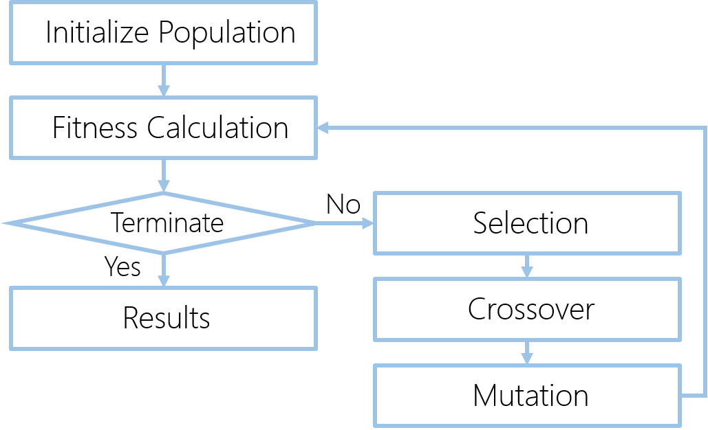

# Genetic Algorithm Implementation in Python

This tutorial will implement the genetic algorithm optimization technique in Python based on a simple example in which we are trying to maximize the output of an equation.

We try to maximum the followed function using Genetic Algorithm.
http://latex.codecogs.com/svg.latex?y = \sum_{i=1}^6 w_ix_i
and
$$(w_1, w_2, w_3, w_4, w_5, w_6) = (4, -2, 3.5, 5, -11, -4.7)$$
$$-4 < x_i < 4$$

The Genetic algorithm is shown as followed.

